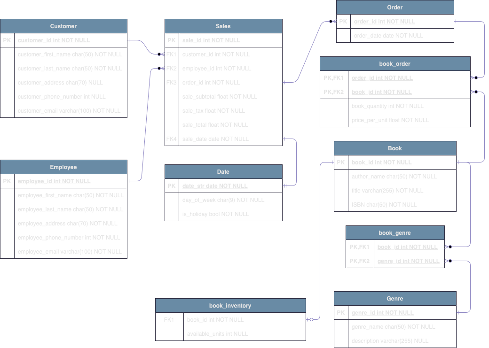
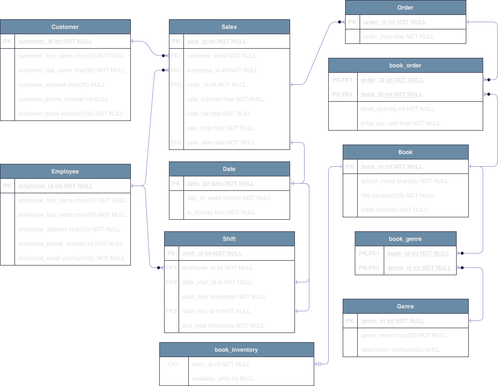

# Assignment 1: Design a Logical Model

## Question 1
Create a logical model for a small bookstore. 📚

At the minimum it should have employee, order, sales, customer, and book entities (tables). Determine sensible column and table design based on what you know about these concepts. Keep it simple, but work out sensible relationships to keep tables reasonably sized. Include a date table. There are several tools online you can use, I'd recommend [_Draw.io_](https://www.drawio.com/) or [_LucidChart_](https://www.lucidchart.com/pages/).

1. In this first version I added the first revision of the bookstore ERD, without employee shifts. 
 

## Question 2
We want to create employee shifts, splitting up the day into morning and evening. Add this to the ERD.

1. In this revision I am adding the employee shift table. In this ERD the relationships from shift to date are 1 to 1 (since each date -start and end- can only match with one date -in the table date-). 
    * It is remarkable to notice that a shift can end in a different day than it's start date, that's why the date_end becomes a very important column, i.e. 10PM to 6AM *next day*

    

## Question 3
The store wants to keep customer addresses. Propose two architectures for the CUSTOMER_ADDRESS table, one that will retain changes, and another that will overwrite. Which is type 1, which is type 2?

_Hint, search type 1 vs type 2 slowly changing dimensions._

Bonus: Are there privacy implications to this, why or why not?

1. Type 1 Overwriting the data: 
    * Each time that the customer changes their address then the column will be updated and there won't exist any historical data.
1. Type 2 Inserting a new row with each change: 
    * Each time that the customer changes their address then a new row will be inserted into the CUSTOMER_ADDRESS table with the updated value, also, an update will be executed to mark that the previous address is not in use anymore. There won't be any data deletion so the historical data can be retrieved.
1. Privacy implications: having the historical record of customer addresses implies that in case of a data breach the attackers will have access to confidential information that can be used to generate a more complete profile of the victim, and even lead to physical threats or harm, in this scenario is even safier to ask the store data owner if it is completely necessary to keep track of the customer addresses or if it will be better to ask only in case of delivery

## Question 4
Review the AdventureWorks Schema [here](https://imgur.com/a/u0m8fX6)

Highlight at least two differences between it and your ERD. Would you change anything in yours?

* One main difference that I would have used is that the AdventureWorks Schema has a Person table instead of customer/employee. I think that this level of abstraction allows us to have a database with less redundance and more organized, also a person could have more than a role (i.e. an employee that is also a customer of the bookstore :smile:)
* The ERD is much more complex with several relationships that can make the readability a little harder and also will need more data storage space (i.e. having the phone number as a separate table with relationships to other info, appart from the contact type and address info which could be simplified into one contact_info table).
    * For this point I would prefer simplicity and maintainability

# Criteria

[Assignment Rubric](./assignment_rubric.md)

# Submission Information

🚨 **Please review our [Assignment Submission Guide](https://github.com/UofT-DSI/onboarding/blob/main/onboarding_documents/submissions.md)** 🚨 for detailed instructions on how to format, branch, and submit your work. Following these guidelines is crucial for your submissions to be evaluated correctly.

### Submission Parameters:
* Submission Due Date: `September 28, 2024`
* The branch name for your repo should be: `model-design`
* What to submit for this assignment:
    * This markdown (design_a_logical_model.md) should be populated.
    * Two Entity-Relationship Diagrams (preferably in a pdf, jpeg, png format).
* What the pull request link should look like for this assignment: `https://github.com/<your_github_username>/sql/pull/<pr_id>`
    * Open a private window in your browser. Copy and paste the link to your pull request into the address bar. Make sure you can see your pull request properly. This helps the technical facilitator and learning support staff review your submission easily.

Checklist:
- [x] Create a branch called `model-design`.
- [x] Ensure that the repository is public.
- [x] Review [the PR description guidelines](https://github.com/UofT-DSI/onboarding/blob/main/onboarding_documents/submissions.md#guidelines-for-pull-request-descriptions) and adhere to them.
- [x] Verify that the link is accessible in a private browser window.

If you encounter any difficulties or have questions, please don't hesitate to reach out to our team via our Slack at `#cohort-4-help`. Our Technical Facilitators and Learning Support staff are here to help you navigate any challenges.
